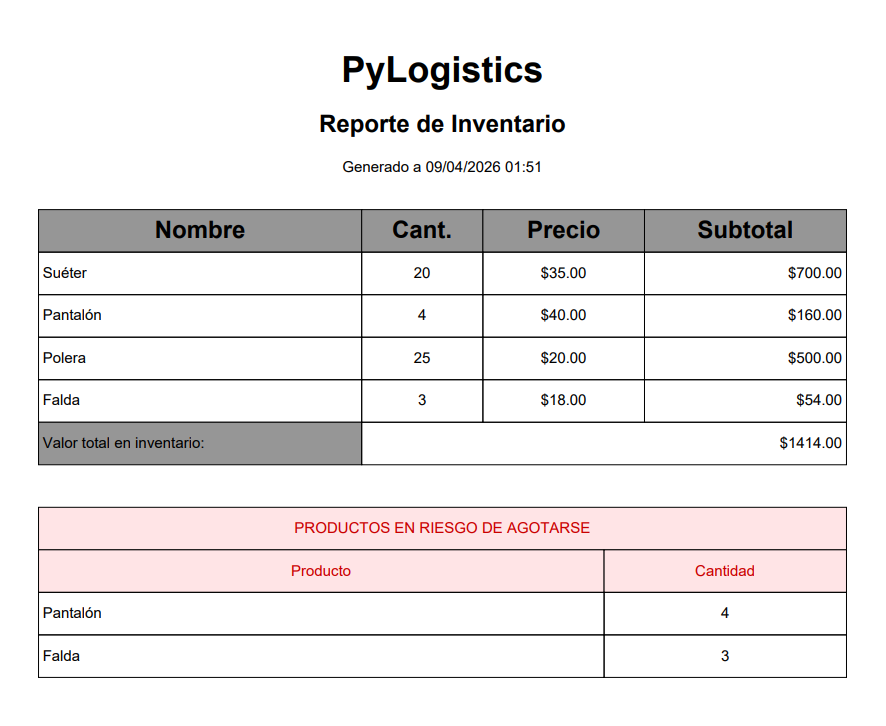

# 📦 PyLogistics - Inventory Management System

A **Python-based** inventory management system designed to optimize stock control and financial reporting for supply chains or e-commerce businesses.

---

## 🚀 Key Features

* **Intelligent Stock Management:** Automatically detects existing products to update quantities or registers new items seamlessly.
* **Automated Tax Logic:** Includes a 15% tax calculation specifically for imported goods.
* **Data Integrity:** Robust input validation to prevent errors in pricing, quantities, and data types.
* **Stock Safety Protocols:** Restricts the deletion of products that still have units in stock to maintain database integrity.
* **Professional PDF Reporting:** Generates dynamic PDF reports including:
    * Complete valued inventory list.
    * High-priority alerts for low-stock items (units < 5).

---



---

## 🛠️ Tech Stack

* **Language:** Python 3.x
* **Libraries:**
    * `fpdf2`: For dynamic report generation.
    * `datetime`: For precise report timestamps.

---

## 📥 Installation & Usage

1. Clone the repository:
   ```bash
   git clone [https://github.com/DavP-Dev/PyLogistics-Manager.git](https://github.com/DavP-Dev/PyLogistics-Manager.git)
   ```
2. Install dependencies:
   ```bash
   pip install fpdf2
   ```
3. Run the application:
   ```bash
   python katra_logistica.py
   ```
   
---

## 🧠 About the Project (Self-Taught Path)
This project was developed as part of my **self-taught** journey in software engineering. It demonstrates my ability to implement:

Complex data structures (List of dictionaries).

Search and update algorithms.

Third-party library integration.

Critical thinking applied to real-world business rules.

---

## 📧 Contact
**DavP-Dev** - Python Developer focused on logistics and administrative automation.
